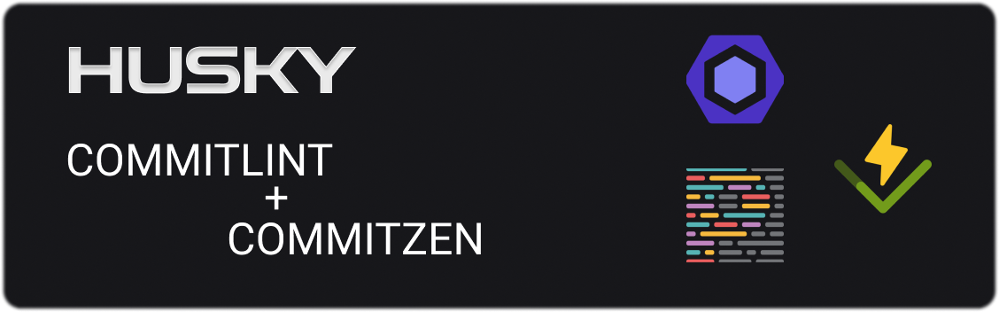

<h1 align="center">
  
</h1>

## ✨ What was used in this project:

- [React](https://reactjs.org/)
- [TypeScript](https://www.typescriptlang.org/)
- [Vite](https://vitejs.dev)
- [Husky](https://typicode.github.io/husky/#/)
- [Commitlint](https://commitlint.js.org/#/)
- [Lint-staged](https://github.com/okonet/lint-staged)
- [Commitzen](http://commitizen.github.io/cz-cli/)
- [Eslint](https://eslint.org/)
- [Prettier](https://prettier.io/)
- [Vitest](https://vitest.dev)
- [React Testing Library](https://testing-library.com/docs/react-testing-library/intro)

## ✨ How to start the project

### Install dependencies:

```bash
yarn
```

With that, the dependencies will be installed, and the husky will have prepared its scripts, if the husky is not working, run this:

```bash
yarn prepare
```

### After modifying some file, and using git add .

```bash
yarn commit
```

With that, the whole process will execute in order, the commit, the steps to check the eslint and the tests, and finally, if everything passes, it will return a success message and just need to use the:

```bash
git push
```

Note: You can use this same configuration in your project, if you try to commit to my repository, I think it will return an error.
